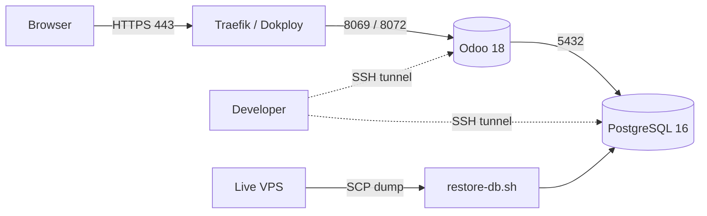

# Odoo 18 — Dockerized Dev Environment (Dokploy)

Production-quality **Odoo 18** development stack for **Ubuntu 24.04**, run with
**Docker Compose** and deployed/managed by **Dokploy** (Traefik reverse proxy,
HTTPS via Let's Encrypt). Databases are imported from a remote/live VPS.

> Replaces the old bare-metal `install_odoo14.sh` approach with a reproducible,
> container-based Odoo 18 setup.

## Features
- Odoo 18 + PostgreSQL 16 containers with persistent volumes
- Public HTTPS access through a domain (Dokploy / Traefik)
- Internal services bound to `127.0.0.1` → SSH-tunnel dev access only
- Secrets via `.env` (auto-generated, never committed)
- One-command VPS bootstrap and database restore from a remote VPS

## Project structure
```
.
├── docker-compose.yml        # Odoo 18 + PostgreSQL + Traefik labels
├── .env.example              # Copy to .env; secrets auto-filled by setup
├── .gitignore
├── config/
│   └── odoo.conf.template    # Rendered to config/odoo.conf (git-ignored)
├── addons/                   # Custom addons → /mnt/extra-addons
├── backups/                  # Downloaded dumps (git-ignored)
├── scripts/
│   ├── setup-vps.sh          # Install Docker, prep folders, secrets, start
│   └── restore-db.sh         # Fetch remote dump + restore into PostgreSQL
└── docs/
    ├── DOKPLOY.md            # Deploy from GitHub via Dokploy
    ├── DEVELOPER_ACCESS.md   # SSH tunnels, PyCharm, VS Code, debugging
    └── SECURITY.md           # Firewall, ports, hardening
```

## Architecture


## Quick start (on the VPS)
```bash
git clone https://github.com/<you>/<repo>.git odoo18 && cd odoo18
chmod +x scripts/*.sh
sudo ./scripts/setup-vps.sh          # installs Docker, writes .env, starts the stack
```
Point your DNS **A record** for `DOMAIN` at the VPS, then deploy through Dokploy —
see [docs/DOKPLOY.md](docs/DOKPLOY.md).

> Want Dokploy to own the deployment? Prepare only, don't auto-start:
> ```bash
> START_STACK=no sudo -E ./scripts/setup-vps.sh
> ```

## Configuration
Edit `.env` (template: [.env.example](.env.example)). Key values:

| Variable | Purpose |
|----------|---------|
| `PROJECT_NAME` | Container / Traefik router name prefix |
| `DOMAIN` | Public hostname (Traefik + HTTPS) |
| `ODOO_ADMIN_PASSWD` | Odoo master password (DB manager) |
| `POSTGRES_USER` / `POSTGRES_PASSWORD` / `POSTGRES_DB` | Database credentials |
| `ODOO_PORT` / `POSTGRES_PORT` | Localhost-only bind ports (SSH tunnels) |
| `ADDONS_PATH` | Comma-separated addons paths in-container |
| `LIST_DB` | `False` in production to hide the DB manager |
| `REMOTE_*` / `TARGET_DB` | Remote dump source (fill in later) |

After editing `.env`, re-render the config and restart:
```bash
set -a; . ./.env; set +a
envsubst < config/odoo.conf.template > config/odoo.conf
docker compose up -d
```

## Import a database from the live VPS
Fill the `REMOTE_*` values in `.env`, then:
```bash
./scripts/restore-db.sh --drop                     # download + restore, replace existing
./scripts/restore-db.sh --file backups/live.dump   # restore a local dump
docker compose restart odoo
```
Supports `.sql`, `.sql.gz`, custom `pg_dump` (`.dump/.backup`), and Odoo `.zip`
backups (restores `dump.sql` + filestore). Details in
[docs/DEVELOPER_ACCESS.md](docs/DEVELOPER_ACCESS.md).

## Common commands
```bash
docker compose ps
docker compose logs -f odoo
docker compose restart odoo
docker compose down                            # stop (keeps volumes)
docker compose pull && docker compose up -d    # update images
```

## Documentation
- [Dokploy deployment](docs/DOKPLOY.md)
- [Developer access — SSH, PyCharm, VS Code, debug](docs/DEVELOPER_ACCESS.md)
- [Security recommendations](docs/SECURITY.md)

## Notes
- This is a **development** VPS, not production.
- The database comes from a **separate** live VPS — provide `REMOTE_*` details later;
  no rewrite needed.
- Nothing internal is public — only 80/443 via Traefik. Devs connect over SSH tunnels.
